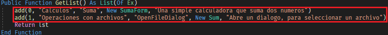
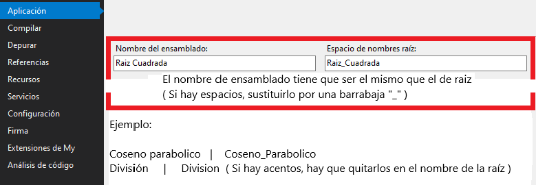
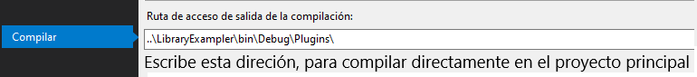

# Library Exampler
Aqui os traigo, un framework, para exponer ejemplos de librerias, basado en DLL

## ¿Como crear los ejercicios?
Basta con copiar el subproyecto "Example".

Aqui esta por pasos:  
    1. Borrar los ejemplos existentes 
    2. Crea tus propios ejemplos. Plantilla:   
```vb
--> add(Type, Group, Name, Class, Descript) <--
Type as boolean
    0 --> Formulario
    1 --> Clase (Se invocara el sub: Exec())
Group as String
    Indica el nombre de la categoria
Name as string
    Indica el nombre que se le aplicara al ejemplo
Class as Object
    if Type = 0 --> Indicara el formulario que se abrira
    if Type = 1 --> Indicara la clase que se va a ejecutar
Descript as string
    Descripcion del ejemplo que se ejecutará

EJEMPLOS:
add(0,"Calculos","Suma",new Suma,"Muestra un formulario donde se sumarán dos valores")
add(1,"Operaciones con archivos","OpenFile",new OpenFile,"Al ejecutar este ejemplo, se abrira un cuadro de dialogo para abrir un archivo")
```

```VB
Ejemplo de clase:
--------------------------------
Imports System.Windows.Forms
Public Class OpenFile
    Public Sub Exec() ' Esta clase siempre tiene que estar presente, ya que es la que se invocará al ejecutar el ejemplo
        Dim op As New OpenFileDialog
        If op.ShowDialog = DialogResult.OK Then
            MsgBox("Has seleccionado el siguiente archivo: " & vbCrLf & op.FileName)
        End If
    End Sub
End Class
```

3. Antes de compilar el dll, cambiar las propiedades


4. Compilar el proyecto, y mover el dll a la carpeta de plugins

> Nota: para ensamblar directamente los plugins en el proyecto principal, escribe esta dirección en las opciones de depuración:
